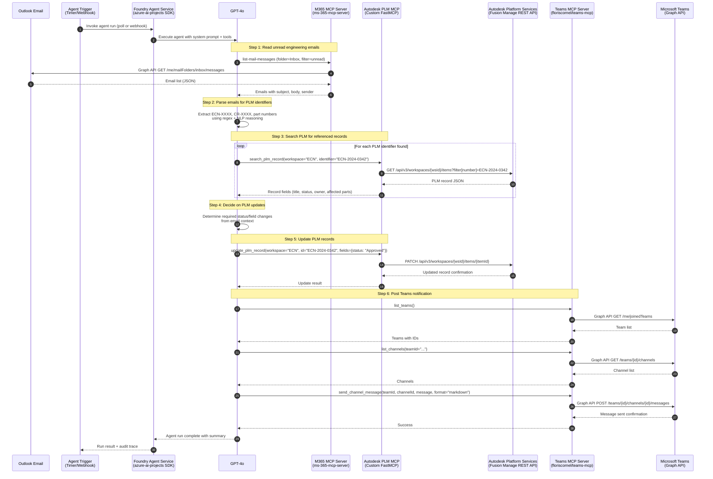

# Integration Architecture Research
## AI Agent Pipeline: Email → PLM → Teams Notification

**Date:** 2026-05-04  
**Status:** Complete  
**Research Topics:** End-to-end integration architecture and mock data for AI Agent pipeline

---

## Table of Contents

1. [System Architecture & Sequence Diagram](#1-system-architecture--sequence-diagram)
2. [Mock Email Data (Autodesk Engineering Scenarios)](#2-mock-email-data)
3. [Mock Autodesk PLM Data](#3-mock-autodesk-plm-data)
4. [PLM Identifier Extraction from Email](#4-plm-identifier-extraction)
5. [MCP Tool Call Sequence](#5-mcp-tool-call-sequence)
6. [Teams Notification Format](#6-teams-notification-format)
7. [Agent System Prompt](#7-agent-system-prompt)
8. [Custom MCP Server for Autodesk PLM](#8-custom-mcp-server-for-autodesk-plm)
9. [Error Handling & Retry Patterns](#9-error-handling--retry-patterns)
10. [Minimal Working Demo Setup](#10-minimal-working-demo-setup)
11. [Component References](#11-component-references)

---

## 1. System Architecture & Sequence Diagram

### Component Overview

| Component | Technology | Purpose |
|---|---|---|
| Email Source | Microsoft Outlook / Exchange | Engineering notification emails |
| M365 MCP Server | `@softeria/ms-365-mcp-server` | Read emails via Graph API |
| Autodesk PLM MCP | Custom FastMCP Python server | Search & update Fusion Manage |
| Teams MCP Server | `@floriscornel/teams-mcp` | Post channel notifications |
| Orchestrator | Azure Foundry Agent Service + `azure-ai-projects` SDK | LLM reasoning & tool dispatch |
| LLM | GPT-4o (via Foundry) | Parse, reason, generate summaries |

### Mermaid Sequence Diagram



### Architecture Decision Notes

- **Orchestration**: Foundry Agent Service manages all LLM ↔ tool interactions; the agent's system prompt defines the workflow
- **MCP Transport**: All three MCP servers use stdio transport locally for dev; switch to HTTP/SSE for production
- **Authentication**: M365 and Teams MCP use Microsoft Graph with delegated OAuth; Autodesk PLM uses APS client credentials
- **Error Boundary**: Each MCP tool call returns structured errors; agent retries with exponential backoff

---

## 2. Mock Email Data

### Email 1: ECN Approval Request

```json
{
  "id": "AAMkAGI2ZTlmNjEw",
  "subject": "ECN-2024-0342: Engineering Change Notice Requires Your Approval",
  "from": {
    "emailAddress": {
      "name": "Sarah Chen",
      "address": "sarah.chen@acme-engineering.com"
    }
  },
  "toRecipients": [
    {
      "emailAddress": {
        "name": "James Whitfield",
        "address": "j.whitfield@acme-engineering.com"
      }
    }
  ],
  "receivedDateTime": "2024-11-15T09:23:00Z",
  "isRead": false,
  "importance": "high",
  "body": {
    "contentType": "html",
    "content": "<p>Hi James,</p><p>ECN <strong>ECN-2024-0342</strong> - <em>Redesign of Heat Exchanger Bracket Assembly</em> has been routed to you for final approval.</p><p><strong>Change Summary:</strong></p><ul><li>Part Number: <strong>100-4821</strong> (Heat Exchanger Bracket - Rev B to Rev C)</li><li>Part Number: <strong>100-4822</strong> (Mounting Flange - Rev A to Rev B)</li><li>Reason: Field failure reports indicate fatigue cracking at weld joint under thermal cycling</li><li>Estimated Impact: Medium - affects 3 active assemblies</li></ul><p>PLM Workspace: ECN | Item ID: 1452<br/>Change Request: <strong>CR-2024-0287</strong></p><p>Please review and approve by EOD Friday, 2024-11-22.</p><p>Regards,<br/>Sarah Chen<br/>Senior Mechanical Engineer</p>"
  },
  "categories": ["Engineering", "PLM", "Approval Required"]
}
```

### Email 2: Change Request Notification

```json
{
  "id": "AAMkAGI2ZTlmNjEy",
  "subject": "[PLM Notification] Change Request CR-2024-0301 Status Updated",
  "from": {
    "emailAddress": {
      "name": "Fusion Manage System",
      "address": "plm-notifications@acme-engineering.com"
    }
  },
  "toRecipients": [
    {
      "emailAddress": {
        "name": "PLM Engineering Team",
        "address": "plm-team@acme-engineering.com"
      }
    }
  ],
  "receivedDateTime": "2024-11-15T11:45:00Z",
  "isRead": false,
  "importance": "normal",
  "body": {
    "contentType": "text",
    "content": "The following Change Request has been updated in Fusion Manage:\n\nChange Request: CR-2024-0301\nTitle: Tolerance Adjustment for Turbine Blade Profile\nPrevious Status: In Design\nNew Status: Under Review\nUpdated By: Marcus Okafor (m.okafor@acme-engineering.com)\nTimestamp: 2024-11-15 11:40 UTC\n\nAffected Parts:\n- 200-0891 (Turbine Blade Stage 1 - Rev D)\n- 200-0892 (Blade Root Attachment - Rev B)\n\nAssociated ECN: ECN-2024-0338\n\nReview deadline: 2024-11-29\nAccess the record: https://acme.autodeskplm360.net/workspace/changeorders/CR-2024-0301\n\nThis is an automated notification from Fusion Manage."
  },
  "categories": ["PLM", "Change Request", "Automated"]
}
```

### Email 3: Part Status Update

```json
{
  "id": "AAMkAGI2ZTlmNjEz",
  "subject": "URGENT: Part 300-1204 obsoleted — downstream impact on ECN-2024-0355",
  "from": {
    "emailAddress": {
      "name": "David Reinholt",
      "address": "d.reinholt@acme-engineering.com"
    }
  },
  "toRecipients": [
    {
      "emailAddress": {
        "name": "ECN Review Board",
        "address": "ecn-board@acme-engineering.com"
      }
    }
  ],
  "receivedDateTime": "2024-11-15T14:10:00Z",
  "isRead": false,
  "importance": "high",
  "body": {
    "contentType": "html",
    "content": "<p>Team,</p><p>Part <strong>300-1204</strong> (Seal Assembly Sub-Frame) has been marked <strong>Obsolete</strong> in Fusion Manage due to supplier discontinuation (Supplier: FormTech Industries, SKU: FT-8832).</p><p>This part is referenced in <strong>ECN-2024-0355</strong> as a retained component. The ECN must be updated to either:</p><ol><li>Substitute with approved alternate <strong>300-1205</strong> (FormTech FT-8833 compatible)</li><li>Issue a new CR for re-design if no alternate is suitable</li></ol><p>Current ECN-2024-0355 status: <strong>In Review</strong><br/>Assigned Engineer: Lisa Park (l.park@acme-engineering.com)<br/>ECN workspace item ID: 1478</p><p>Please update the PLM record and notify the project lead immediately.</p><p>— David Reinholt, Supply Chain Engineering</p>"
  },
  "categories": ["URGENT", "Parts", "ECN", "Supply Chain"]
}
```

### Email 4: Bulk ECN Digest

```json
{
  "id": "AAMkAGI2ZTlmNjE0",
  "subject": "[Weekly Digest] Open ECNs Awaiting Action — 4 items",
  "from": {
    "emailAddress": {
      "name": "Fusion Manage Digest",
      "address": "digest@acme-engineering.com"
    }
  },
  "toRecipients": [
    {
      "emailAddress": {
        "name": "Engineering Managers",
        "address": "eng-managers@acme-engineering.com"
      }
    }
  ],
  "receivedDateTime": "2024-11-15T07:00:00Z",
  "isRead": false,
  "importance": "normal",
  "body": {
    "contentType": "text",
    "content": "Weekly PLM Digest - 2024-11-11 to 2024-11-15\n\nOPEN ECNs AWAITING ACTION:\n\n1. ECN-2024-0339 | Cooling Fan Bracket Redesign | Status: Pending Approval | Owner: Sarah Chen | Due: 2024-11-18\n2. ECN-2024-0342 | Heat Exchanger Bracket Assembly | Status: In Review | Owner: James Whitfield | Due: 2024-11-22\n3. ECN-2024-0350 | Motor Controller Housing | Status: Draft | Owner: Carlos Mendez | Due: 2024-11-25\n4. ECN-2024-0355 | Seal Assembly Sub-Frame | Status: In Review | Owner: Lisa Park | Due: 2024-11-20\n\nTOTAL OPEN CHANGE REQUESTS: 7\nHIGH PRIORITY ITEMS: 2 (ECN-2024-0339, ECN-2024-0355)\n\nFull report: https://acme.autodeskplm360.net/reports/weekly-digest"
  },
  "categories": ["PLM", "Digest", "Management"]
}
```

---

## 3. Mock Autodesk PLM Data

### Workspace Structure

Autodesk Fusion Manage organizes data into **workspaces**. Standard workspace IDs (tenant-specific integers):

```json
{
  "workspaces": [
    {
      "id": 57,
      "name": "Engineering Change Notices",
      "shortName": "ECN",
      "description": "Tracks engineering change notices",
      "defaultView": "ecn-list-view"
    },
    {
      "id": 42,
      "name": "Change Orders",
      "shortName": "CO",
      "description": "Formal change orders for release",
      "defaultView": "co-list-view"
    },
    {
      "id": 14,
      "name": "Parts",
      "shortName": "PARTS",
      "description": "Part master records",
      "defaultView": "part-list-view"
    },
    {
      "id": 28,
      "name": "Change Requests",
      "shortName": "CR",
      "description": "Engineering change requests",
      "defaultView": "cr-list-view"
    }
  ]
}
```

### ECN Item Record (Full)

```json
{
  "id": "1452",
  "workspaceId": 57,
  "number": "ECN-2024-0342",
  "title": "Redesign of Heat Exchanger Bracket Assembly",
  "status": "In Review",
  "createdDate": "2024-11-01T08:00:00Z",
  "modifiedDate": "2024-11-15T09:30:00Z",
  "fields": {
    "ECN_NUMBER": {
      "fieldId": "ECN_NUMBER",
      "label": "ECN Number",
      "value": "ECN-2024-0342",
      "type": "text"
    },
    "TITLE": {
      "fieldId": "TITLE",
      "label": "Title",
      "value": "Redesign of Heat Exchanger Bracket Assembly",
      "type": "text"
    },
    "STATUS": {
      "fieldId": "STATUS",
      "label": "Status",
      "value": "In Review",
      "allowedValues": ["Draft", "In Review", "Pending Approval", "Approved", "Released", "Rejected", "Obsolete"],
      "type": "picklist"
    },
    "PRIORITY": {
      "fieldId": "PRIORITY",
      "label": "Priority",
      "value": "Medium",
      "allowedValues": ["Low", "Medium", "High", "Critical"],
      "type": "picklist"
    },
    "CHANGE_REASON": {
      "fieldId": "CHANGE_REASON",
      "label": "Reason for Change",
      "value": "Field failure reports indicate fatigue cracking at weld joint under thermal cycling conditions. Root cause analysis (RCA-2024-112) confirmed design deficiency at T-joint.",
      "type": "textarea"
    },
    "ORIGINATOR": {
      "fieldId": "ORIGINATOR",
      "label": "Originator",
      "value": "sarah.chen@acme-engineering.com",
      "type": "user"
    },
    "APPROVER": {
      "fieldId": "APPROVER",
      "label": "Approver",
      "value": "j.whitfield@acme-engineering.com",
      "type": "user"
    },
    "CATEGORY": {
      "fieldId": "CATEGORY",
      "label": "Change Category",
      "value": "Design - Safety",
      "type": "picklist"
    },
    "IMPLEMENTATION_DATE": {
      "fieldId": "IMPLEMENTATION_DATE",
      "label": "Target Implementation Date",
      "value": "2024-12-01",
      "type": "date"
    },
    "ASSOCIATED_CR": {
      "fieldId": "ASSOCIATED_CR",
      "label": "Associated Change Request",
      "value": "CR-2024-0287",
      "type": "reference"
    }
  },
  "affectedItems": [
    {
      "partNumber": "100-4821",
      "partTitle": "Heat Exchanger Bracket",
      "fromRevision": "B",
      "toRevision": "C",
      "disposition": "Replace"
    },
    {
      "partNumber": "100-4822",
      "partTitle": "Mounting Flange",
      "fromRevision": "A",
      "toRevision": "B",
      "disposition": "Replace"
    }
  ],
  "workflow": {
    "currentStep": "Engineering Review",
    "stepHistory": [
      { "step": "Draft", "completedBy": "sarah.chen@acme-engineering.com", "completedDate": "2024-11-05T10:00:00Z" },
      { "step": "Initiator Review", "completedBy": "sarah.chen@acme-engineering.com", "completedDate": "2024-11-08T14:30:00Z" },
      { "step": "Engineering Review", "assignedTo": "j.whitfield@acme-engineering.com", "startedDate": "2024-11-10T09:00:00Z" }
    ]
  }
}
```

### Change Request (CR) Record

```json
{
  "id": "892",
  "workspaceId": 28,
  "number": "CR-2024-0287",
  "title": "Heat Exchanger Bracket Fatigue Fix",
  "status": "Under Review",
  "fields": {
    "CR_NUMBER": { "value": "CR-2024-0287" },
    "TITLE": { "value": "Heat Exchanger Bracket Fatigue Fix" },
    "STATUS": { "value": "Under Review" },
    "DESCRIPTION": { "value": "During commissioning test cycle TC-4882, bracket assembly showed micro-cracking at weld joint after 500 thermal cycles (target: 10,000). FEA model updated to reflect actual operating loads." },
    "REQUESTED_BY": { "value": "sarah.chen@acme-engineering.com" },
    "CATEGORY": { "value": "Safety" },
    "LINKED_ECN": { "value": "ECN-2024-0342" },
    "PRIORITY": { "value": "High" }
  }
}
```

### Part Item Record

```json
{
  "id": "3391",
  "workspaceId": 14,
  "number": "100-4821",
  "title": "Heat Exchanger Bracket",
  "revision": "B",
  "status": "Released",
  "fields": {
    "PART_NUMBER": { "value": "100-4821" },
    "DESCRIPTION": { "value": "Structural bracket for heat exchanger mounting on Frame Sub-Assembly A" },
    "REVISION": { "value": "B" },
    "STATUS": {
      "value": "Released",
      "allowedValues": ["In Design", "Released", "Obsolete", "On Hold"]
    },
    "MATERIAL": { "value": "304 Stainless Steel" },
    "MANUFACTURER": { "value": "Acme In-House Fabrication" },
    "WEIGHT_KG": { "value": 0.842 },
    "LEAD_TIME_DAYS": { "value": 14 },
    "DRAWING_NUMBER": { "value": "DRG-100-4821-B" },
    "PARENT_ASSEMBLY": { "value": "500-0021 (Frame Sub-Assembly A)" }
  },
  "pendingChanges": [
    {
      "ecnNumber": "ECN-2024-0342",
      "targetRevision": "C",
      "status": "In Review"
    }
  ]
}
```

---

## 4. PLM Identifier Extraction

### Regex Patterns

```python
import re
from dataclasses import dataclass
from typing import Optional

@dataclass
class PLMIdentifiers:
    ecn_numbers: list[str]
    cr_numbers: list[str]
    part_numbers: list[str]
    workspace_ids: list[str]

def extract_plm_identifiers(email_body: str) -> PLMIdentifiers:
    """
    Extract all PLM identifiers from an email body using regex.
    Handles both plain text and HTML (strips tags first).
    """
    # Strip HTML tags if present
    clean_text = re.sub(r'<[^>]+>', ' ', email_body)
    # Normalize whitespace
    clean_text = re.sub(r'\s+', ' ', clean_text)

    # ECN pattern: ECN-YYYY-NNNN (4-digit year, 4-digit sequence)
    ecn_pattern = r'\bECN-\d{4}-\d{4}\b'
    ecn_numbers = list(set(re.findall(ecn_pattern, clean_text, re.IGNORECASE)))

    # Change Request pattern: CR-YYYY-NNNN
    cr_pattern = r'\bCR-\d{4}-\d{4}\b'
    cr_numbers = list(set(re.findall(cr_pattern, clean_text, re.IGNORECASE)))

    # Autodesk part number pattern: NNN-NNNN (3-digit category, 4-digit ID)
    # Avoids matching phone numbers, dates, IP addresses
    part_pattern = r'\b([1-9]\d{2}-\d{4})\b(?!\d)'
    # Filter to known category prefixes: 100=Mechanical, 200=Electrical, 300=Assembly, etc.
    raw_parts = re.findall(part_pattern, clean_text)
    valid_prefixes = {'100', '200', '300', '400', '500', '600'}
    part_numbers = list(set(
        p for p in raw_parts
        if p.split('-')[0] in valid_prefixes
    ))

    # Workspace item IDs from URLs like /workspace/ecn/1452
    ws_pattern = r'/workspace/[a-z]+/(\d+)'
    workspace_ids = list(set(re.findall(ws_pattern, clean_text, re.IGNORECASE)))

    return PLMIdentifiers(
        ecn_numbers=sorted(ecn_numbers),
        cr_numbers=sorted(cr_numbers),
        part_numbers=sorted(part_numbers),
        workspace_ids=workspace_ids
    )

# Example usage
email_text = """
ECN ECN-2024-0342 - Redesign of Heat Exchanger Bracket Assembly
Part Number: 100-4821 (Rev B to Rev C)
Part Number: 100-4822 (Mounting Flange)
Change Request: CR-2024-0287
"""

result = extract_plm_identifiers(email_text)
# ECNs:  ['ECN-2024-0342']
# CRs:   ['CR-2024-0287']
# Parts: ['100-4821', '100-4822']
```

### Agent Prompt Guidance for Extraction

The LLM should be instructed to:
1. First use regex extraction (via a helper tool) to get structured identifiers
2. Supplement with NLP: catch informal references like "the bracket ECN" or "that change request from last week"
3. Disambiguate when multiple ECNs appear in a digest email (process each independently)
4. Use email subject line as high-signal identifier source (often contains primary ID)

---

## 5. MCP Tool Call Sequence

### Step-by-Step Tool Calls

```
STEP 1: Read unread emails
Tool: list-mail-messages (ms-365-mcp-server)
Parameters:
  {
    "folderId": "inbox",
    "filter": "$filter=isRead eq false and categories/any(c:c eq 'PLM')",
    "top": 10,
    "select": "id,subject,from,body,receivedDateTime,importance,categories"
  }
Returns: Array of email objects

STEP 2: For each relevant email, get full body
Tool: get-mail-message (ms-365-mcp-server)
Parameters:
  {
    "messageId": "AAMkAGI2ZTlmNjEw"
  }
Returns: Full email with body content

STEP 3: Mark email as read (after processing)
Tool: update-mail-message (ms-365-mcp-server)
Parameters:
  {
    "messageId": "AAMkAGI2ZTlmNjEw",
    "isRead": true
  }
Returns: Updated message

STEP 4: Search PLM for ECN record
Tool: search_plm_record (Custom Autodesk PLM MCP)
Parameters:
  {
    "workspace": "ECN",
    "identifier": "ECN-2024-0342"
  }
Returns: PLM item JSON with all fields

STEP 5: Search PLM for Change Request
Tool: search_plm_record (Custom Autodesk PLM MCP)
Parameters:
  {
    "workspace": "CR",
    "identifier": "CR-2024-0287"
  }
Returns: CR item JSON

STEP 6: Update PLM ECN status
Tool: update_plm_record (Custom Autodesk PLM MCP)
Parameters:
  {
    "workspace": "ECN",
    "item_id": "1452",
    "fields": {
      "STATUS": "Pending Approval",
      "APPROVER": "j.whitfield@acme-engineering.com"
    }
  }
Returns: Update confirmation

STEP 7: List Teams for notification
Tool: list_teams (floriscornel/teams-mcp)
Parameters: {}
Returns: Array of team objects with IDs

STEP 8: List channels in Engineering team
Tool: list_channels (floriscornel/teams-mcp)
Parameters:
  {
    "teamId": "19:abc123@thread.tacv2"
  }
Returns: Array of channels

STEP 9: Send Teams notification
Tool: send_channel_message (floriscornel/teams-mcp)
Parameters:
  {
    "teamId": "19:abc123@thread.tacv2",
    "channelId": "19:xyz789@thread.tacv2",
    "message": "## PLM Update: ECN-2024-0342\n\n...",
    "format": "markdown",
    "importance": "high"
  }
Returns: Message sent confirmation
```

---

## 6. Teams Notification Format

### Markdown Message (via `format: "markdown"`)

```markdown
## 🔧 PLM Action Summary — ECN-2024-0342

**Engineering Change Notice: Approved for Review**

| Field | Value |
|---|---|
| ECN Number | ECN-2024-0342 |
| Title | Redesign of Heat Exchanger Bracket Assembly |
| Status | ✅ Pending Approval (updated from In Review) |
| Priority | 🔴 Medium |
| Approver | @james.whitfield |
| Due Date | 2024-11-22 |

**Affected Parts:**
- `100-4821` — Heat Exchanger Bracket (Rev B → Rev C)
- `100-4822` — Mounting Flange (Rev A → Rev B)

**Source Email:** Sarah Chen · 2024-11-15 09:23 UTC
**Associated CR:** CR-2024-0287

---
🤖 *Auto-processed by PLM Agent • [View in Fusion Manage](https://acme.autodeskplm360.net/workspace/ecn/1452)*
```

### High-Urgency Alert Message

```markdown
## 🚨 URGENT: PLM Alert — Part Obsolescence Impacts Open ECN

**Part 300-1204 (Seal Assembly Sub-Frame) is now OBSOLETE**

This part is referenced in **ECN-2024-0355** which is currently **In Review**.

**Required Action:**
1. Substitute with approved alternate **300-1205** (FormTech FT-8833 compatible), OR
2. Issue a new Change Request for re-design

**ECN Details:**
- ECN: ECN-2024-0355
- Status: In Review
- Assigned Engineer: @lisa.park
- Review Deadline: 2024-11-20

**Source:** Supply Chain Engineering (David Reinholt) · 2024-11-15 14:10 UTC

---
🤖 *Auto-detected by PLM Agent • [View ECN-2024-0355](https://acme.autodeskplm360.net/workspace/ecn/1478)*
```

### send_channel_message Parameters (Full)

```json
{
  "teamId": "19:abcdef1234567890@thread.tacv2",
  "channelId": "19:uvwxyz0987654321@thread.tacv2",
  "message": "## 🔧 PLM Update: ECN-2024-0342\n\n**Status updated to Pending Approval**\n\n| Field | Value |\n|---|---|\n| ECN | ECN-2024-0342 |\n| Title | Heat Exchanger Bracket Redesign |\n| Approver | j.whitfield@acme-engineering.com |\n| Due | 2024-11-22 |\n\n🤖 *Auto-processed by PLM Agent*",
  "format": "markdown",
  "importance": "high",
  "mentions": [
    {
      "mention": "james.whitfield",
      "userId": "00000000-0000-0000-0000-000000000001"
    }
  ]
}
```

---

## 7. Agent System Prompt

```
You are an Autodesk Engineering PLM Agent. Your job is to:

1. READ unprocessed engineering emails from the inbox that contain references to Autodesk Fusion Manage PLM records (ECNs, Change Requests, part numbers).

2. EXTRACT PLM identifiers from each email:
   - ECN numbers (pattern: ECN-YYYY-NNNN)
   - Change Request numbers (pattern: CR-YYYY-NNNN)
   - Part numbers (pattern: NNN-NNNN, where NNN is a category prefix like 100, 200, 300)

3. LOOK UP each identifier in Fusion Manage PLM using the search_plm_record tool.

4. DETERMINE the appropriate action based on the email content:
   - Approval requests → update ECN status to "Pending Approval"
   - Status change notifications → verify and confirm the status in PLM
   - Obsolescence alerts → flag affected ECNs for review, add comment
   - Digest summaries → compile an overview but do NOT update records without explicit instruction

5. UPDATE PLM records using update_plm_record when:
   - An approval email explicitly routes the ECN for approval
   - A status update email reflects a change that should be mirrored in PLM
   - A part obsolescence affects an open ECN (set ECN status to "On Hold" and add comment)
   NEVER update records when uncertain — instead flag for human review.

6. NOTIFY the Engineering team on Microsoft Teams:
   - Channel: "PLM Updates" in the "Engineering" team
   - Use markdown formatting with a clear subject line
   - Include ECN number, title, new status, affected parts, and source email
   - Tag relevant approvers using @mentions when status reaches "Pending Approval"
   - Use importance: "high" only for urgent/critical items

7. MARK each processed email as read after successfully handling it.

RULES:
- Process only emails received in the last 24 hours unless instructed otherwise
- Do not make up PLM data — if a record is not found, report it as missing
- If an email references multiple ECNs, process each one independently
- Always include the Fusion Manage deep link in Teams notifications
- In case of ambiguity (e.g., multiple ECNs match same part), process the most recent one and flag the others
- Log all actions taken in your response summary

CURRENT DATE: {current_date}
TENANT: acme.autodeskplm360.net
ENGINEERING TEAM ID: (resolved at runtime via list_teams tool)
PLM CHANNEL NAME: PLM Updates
```

---

## 8. Custom MCP Server for Autodesk PLM

### Project Structure

```
autodesk-plm-mcp/
├── server.py              # FastMCP server entrypoint
├── plm_client.py          # APS REST API client
├── auth.py                # APS OAuth 2.0 client credentials
├── models.py              # Pydantic data models
├── requirements.txt
└── .env.example
```

### server.py (Main FastMCP Server)

```python
"""
Autodesk Fusion Manage PLM MCP Server
FastMCP-based server exposing PLM search and update tools to AI agents.
"""
import os
from mcp.server.fastmcp import FastMCP
from plm_client import FusionManageClient
from models import PLMSearchResult, PLMUpdateResult, PLMRecord

# Initialize FastMCP
mcp = FastMCP(
    name="autodesk-plm-mcp",
    stateless_http=True,
    json_response=True
)

# Workspace name to ID mapping (customize per tenant)
WORKSPACE_MAP = {
    "ECN": 57,
    "CR": 28,
    "CO": 42,
    "PARTS": 14,
    "CHANGE_ORDERS": 42,
}

def get_client() -> FusionManageClient:
    return FusionManageClient(
        tenant_url=os.environ["APS_PLM_TENANT_URL"],  # e.g. https://acme.autodeskplm360.net
        client_id=os.environ["APS_CLIENT_ID"],
        client_secret=os.environ["APS_CLIENT_SECRET"],
    )


@mcp.tool()
def search_plm_record(workspace: str, identifier: str) -> PLMSearchResult:
    """
    Search Autodesk Fusion Manage for a PLM record by identifier.
    
    Args:
        workspace: Workspace name (e.g. 'ECN', 'CR', 'PARTS', 'CO')
        identifier: The record identifier (e.g. 'ECN-2024-0342', 'CR-2024-0287', '100-4821')
    
    Returns:
        PLMSearchResult with found record or empty result
    """
    ws_id = WORKSPACE_MAP.get(workspace.upper())
    if not ws_id:
        raise ValueError(f"Unknown workspace '{workspace}'. Valid: {list(WORKSPACE_MAP.keys())}")
    
    client = get_client()
    results = client.search_items(workspace_id=ws_id, identifier=identifier)
    
    if not results:
        return PLMSearchResult(found=False, workspace=workspace, identifier=identifier, records=[])
    
    return PLMSearchResult(
        found=True,
        workspace=workspace,
        identifier=identifier,
        records=results,
        total=len(results)
    )


@mcp.tool()
def update_plm_record(
    workspace: str,
    item_id: str,
    fields: dict[str, str | int | float],
    comment: str | None = None
) -> PLMUpdateResult:
    """
    Update fields on a Fusion Manage PLM record.
    
    Args:
        workspace: Workspace name (e.g. 'ECN', 'CR')
        item_id: The numeric item ID (e.g. '1452')
        fields: Dict of field_id -> new_value to update
        comment: Optional comment to add to the record's activity log
    
    Returns:
        PLMUpdateResult with success/failure details
    """
    ws_id = WORKSPACE_MAP.get(workspace.upper())
    if not ws_id:
        raise ValueError(f"Unknown workspace '{workspace}'. Valid: {list(WORKSPACE_MAP.keys())}")
    
    client = get_client()
    
    # Validate allowed field updates (security: whitelist approach)
    ALLOWED_FIELDS = {
        "ECN": ["STATUS", "PRIORITY", "APPROVER", "COMMENTS", "IMPLEMENTATION_DATE"],
        "CR": ["STATUS", "PRIORITY", "DESCRIPTION", "COMMENTS"],
        "PARTS": ["STATUS", "COMMENTS"],
        "CO": ["STATUS", "APPROVER", "COMMENTS"],
    }
    
    allowed = ALLOWED_FIELDS.get(workspace.upper(), [])
    unauthorized = [f for f in fields if f not in allowed]
    if unauthorized:
        raise ValueError(f"Unauthorized field updates for workspace {workspace}: {unauthorized}")
    
    result = client.update_item(
        workspace_id=ws_id,
        item_id=item_id,
        fields=fields,
        comment=comment
    )
    
    return PLMUpdateResult(
        success=result.get("success", False),
        workspace=workspace,
        item_id=item_id,
        updated_fields=list(fields.keys()),
        message=result.get("message", "")
    )


@mcp.tool()
def get_plm_record(workspace: str, item_id: str) -> PLMRecord:
    """
    Get full details of a PLM record by its item ID.
    
    Args:
        workspace: Workspace name
        item_id: The numeric item ID
    
    Returns:
        Full PLMRecord with all fields and workflow state
    """
    ws_id = WORKSPACE_MAP.get(workspace.upper())
    if not ws_id:
        raise ValueError(f"Unknown workspace '{workspace}'")
    
    client = get_client()
    item = client.get_item(workspace_id=ws_id, item_id=item_id)
    return PLMRecord(**item)


if __name__ == "__main__":
    mcp.run(transport="streamable-http")
```

### plm_client.py (APS REST API Client)

```python
"""
Autodesk Fusion Manage REST API client.
API reference: https://aps.autodesk.com/en/docs/fusionmanage/v1/
"""
import httpx
import time
from typing import Any


class FusionManageClient:
    """
    Client for Autodesk Fusion Manage (PLM 360) REST API v3.
    Uses APS 2-legged OAuth (client credentials flow).
    """
    
    APS_AUTH_URL = "https://developer.api.autodesk.com/authentication/v2/token"
    
    def __init__(self, tenant_url: str, client_id: str, client_secret: str):
        self.tenant_url = tenant_url.rstrip("/")
        self.client_id = client_id
        self.client_secret = client_secret
        self._token: str | None = None
        self._token_expiry: float = 0
    
    def _get_token(self) -> str:
        """Get or refresh APS OAuth 2.0 access token."""
        if self._token and time.time() < self._token_expiry - 60:
            return self._token
        
        response = httpx.post(
            self.APS_AUTH_URL,
            data={
                "grant_type": "client_credentials",
                "scope": "data:read data:write",
                "client_id": self.client_id,
                "client_secret": self.client_secret,
            },
            headers={"Content-Type": "application/x-www-form-urlencoded"},
            timeout=30,
        )
        response.raise_for_status()
        
        token_data = response.json()
        self._token = token_data["access_token"]
        self._token_expiry = time.time() + token_data.get("expires_in", 3600)
        return self._token
    
    def _headers(self) -> dict[str, str]:
        return {
            "Authorization": f"Bearer {self._get_token()}",
            "Content-Type": "application/vnd.api+json",
            "Accept": "application/vnd.api+json",
        }
    
    def search_items(self, workspace_id: int, identifier: str) -> list[dict]:
        """Search PLM workspace items by number/identifier."""
        url = f"{self.tenant_url}/api/v3/workspaces/{workspace_id}/items"
        params = {
            "offset": 0,
            "limit": 5,
            "filter[number]": identifier,
        }
        
        response = httpx.get(url, params=params, headers=self._headers(), timeout=30)
        response.raise_for_status()
        
        data = response.json()
        return data.get("data", [])
    
    def get_item(self, workspace_id: int, item_id: str) -> dict:
        """Get a specific PLM item by its ID."""
        url = f"{self.tenant_url}/api/v3/workspaces/{workspace_id}/items/{item_id}"
        
        response = httpx.get(url, headers=self._headers(), timeout=30)
        response.raise_for_status()
        
        return response.json().get("data", {})
    
    def update_item(
        self,
        workspace_id: int,
        item_id: str,
        fields: dict[str, Any],
        comment: str | None = None
    ) -> dict:
        """Update fields on a PLM item using JSON:API PATCH."""
        url = f"{self.tenant_url}/api/v3/workspaces/{workspace_id}/items/{item_id}"
        
        # Build JSON:API payload
        attributes: dict[str, Any] = {"fields": {}}
        for field_id, value in fields.items():
            attributes["fields"][field_id] = {"value": value}
        
        if comment:
            attributes["comment"] = comment
        
        payload = {
            "data": {
                "type": "items",
                "id": item_id,
                "attributes": attributes
            }
        }
        
        response = httpx.patch(url, json=payload, headers=self._headers(), timeout=30)
        response.raise_for_status()
        
        return {"success": True, "message": f"Item {item_id} updated successfully"}
```

### models.py (Pydantic Models)

```python
from pydantic import BaseModel
from typing import Any

class PLMSearchResult(BaseModel):
    found: bool
    workspace: str
    identifier: str
    records: list[dict[str, Any]]
    total: int = 0

class PLMUpdateResult(BaseModel):
    success: bool
    workspace: str
    item_id: str
    updated_fields: list[str]
    message: str

class PLMRecord(BaseModel):
    id: str
    workspace_id: int | None = None
    number: str | None = None
    title: str | None = None
    status: str | None = None
    fields: dict[str, Any] = {}
    workflow: dict[str, Any] = {}
```

### requirements.txt

```
mcp[cli]>=1.6.0
httpx>=0.27.0
pydantic>=2.0.0
python-dotenv>=1.0.0
```

### MCP Server Config (for Foundry / Claude / VS Code)

```json
{
  "mcpServers": {
    "autodesk-plm": {
      "command": "python",
      "args": ["/path/to/autodesk-plm-mcp/server.py"],
      "env": {
        "APS_PLM_TENANT_URL": "https://acme.autodeskplm360.net",
        "APS_CLIENT_ID": "your-aps-client-id",
        "APS_CLIENT_SECRET": "your-aps-client-secret"
      }
    },
    "ms365": {
      "command": "npx",
      "args": ["-y", "@softeria/ms-365-mcp-server", "--preset", "mail", "--org-mode"]
    },
    "teams-mcp": {
      "command": "npx",
      "args": ["-y", "@floriscornel/teams-mcp@latest"]
    }
  }
}
```

---

## 9. Error Handling & Retry Patterns

### Per-Integration Error Matrix

| Integration | Error Type | Handling Strategy |
|---|---|---|
| M365 MCP / Graph API | `401 Unauthorized` | Token refresh (MSAL handles automatically) |
| M365 MCP / Graph API | `429 Too Many Requests` | Respect `Retry-After` header; exponential backoff |
| M365 MCP / Graph API | `503 Service Unavailable` | Retry up to 3 times with 2s, 4s, 8s delays |
| Autodesk APS OAuth | `401 Unauthorized` | Force token refresh and retry once |
| Fusion Manage REST | `404 Not Found` | Record non-existent; log and notify human for review |
| Fusion Manage REST | `409 Conflict` | Workflow state conflict; retrieve current state and re-evaluate |
| Fusion Manage REST | `403 Forbidden` | Insufficient scope; agent should not retry, escalate to human |
| Teams MCP / Graph API | `401 Unauthorized` | Re-authenticate via OAuth device code |
| Teams MCP / Graph API | `404 Team/Channel` | Re-list teams/channels; IDs may have changed |
| Teams MCP / Graph API | `403 Forbidden` | Missing ChannelMessage.Send permission |
| Foundry Agent Service | Model timeout | Retry with simplified prompt; log original context |

### Python Retry Pattern (for PLM Client)

```python
import time
import httpx
from functools import wraps
from typing import TypeVar, Callable, Any

T = TypeVar("T")

def retry_with_backoff(
    max_retries: int = 3,
    base_delay: float = 1.0,
    max_delay: float = 30.0,
    retryable_status_codes: set[int] = {429, 500, 502, 503, 504}
):
    """Decorator for retrying HTTP calls with exponential backoff."""
    def decorator(func: Callable[..., T]) -> Callable[..., T]:
        @wraps(func)
        def wrapper(*args, **kwargs) -> T:
            last_exception = None
            for attempt in range(max_retries + 1):
                try:
                    return func(*args, **kwargs)
                except httpx.HTTPStatusError as e:
                    last_exception = e
                    if e.response.status_code not in retryable_status_codes:
                        raise  # Non-retryable: propagate immediately
                    
                    if attempt == max_retries:
                        break
                    
                    # Honor Retry-After header if present (429 rate limit)
                    retry_after = e.response.headers.get("Retry-After")
                    if retry_after:
                        delay = float(retry_after)
                    else:
                        delay = min(base_delay * (2 ** attempt), max_delay)
                    
                    time.sleep(delay)
                    
                except httpx.RequestError as e:
                    last_exception = e
                    if attempt < max_retries:
                        time.sleep(min(base_delay * (2 ** attempt), max_delay))
            
            raise last_exception  # Re-raise after all retries exhausted
        return wrapper
    return decorator
```

### Agent-Level Error Handling (System Prompt Addendum)

```
ERROR HANDLING RULES:
- If a PLM record is NOT FOUND: report in Teams notification as "⚠️ PLM record [ID] not found — manual review required"
- If a PLM UPDATE fails with 409 Conflict: retrieve the current record state and re-assess without retrying the update
- If Teams notification fails: log the failure in your response and include the message text so the operator can re-send manually
- If email read fails: do not mark as read; retry on next run
- If APS authentication fails after one refresh: stop processing and alert via a fallback email (do NOT use Teams as it likely shares the same auth failure)
- Never silently skip errors; always include error details in your run summary
```

---

## 10. Minimal Working Demo Setup

### Services & Accounts Required

| Component | Service | Setup Steps |
|---|---|---|
| LLM Host | Azure Foundry Project | Create Foundry project, deploy GPT-4o |
| Email Source | Microsoft 365 (E3/E5 or Developer tenant) | Configure Outlook mailbox, set up test emails |
| M365 MCP | Node.js / npm | `npx @softeria/ms-365-mcp-server --login` |
| Teams MCP | Node.js / npm | `npx @floriscornel/teams-mcp@latest authenticate` |
| PLM MCP | Python 3.11+ | Deploy custom FastMCP server |
| PLM Instance | Autodesk Fusion Manage | Free 30-day trial at manage.autodesk.com |
| APS App | Autodesk Platform Services | Create app at aps.autodesk.com |

### Step-by-Step Demo Bootstrap

```bash
# 1. Install Python dependencies
pip install azure-ai-projects>=2.0.0 azure-identity mcp[cli]>=1.6.0 httpx pydantic python-dotenv

# 2. Authenticate M365 MCP (device code flow)
npx @softeria/ms-365-mcp-server --login --org-mode --preset mail

# 3. Authenticate Teams MCP
npx @floriscornel/teams-mcp@latest authenticate

# 4. Configure environment variables
cat > .env << 'EOF'
# Foundry Agent Service
PROJECT_ENDPOINT=https://your-resource.ai.azure.com/api/projects/your-project
AGENT_NAME=PLMAgent

# Autodesk Platform Services
APS_PLM_TENANT_URL=https://acme.autodeskplm360.net
APS_CLIENT_ID=your-aps-client-id
APS_CLIENT_SECRET=your-aps-client-secret
EOF

# 5. Start the custom PLM MCP server
python autodesk-plm-mcp/server.py
```

### Foundry Agent Orchestration Script

```python
"""
plm_agent_runner.py
Orchestrates the Email→PLM→Teams AI agent using azure-ai-projects SDK 2.x
"""
import os
from dotenv import load_dotenv
from azure.identity import DefaultAzureCredential
from azure.ai.projects import AIProjectClient
from azure.ai.projects.models import PromptAgentDefinition

load_dotenv()

PROJECT_ENDPOINT = os.environ["PROJECT_ENDPOINT"]
AGENT_NAME = os.environ.get("AGENT_NAME", "PLMAgent")

# System prompt (abbreviated — use full version from Section 7)
SYSTEM_PROMPT = """
You are an Autodesk Engineering PLM Agent. Your job is to:
1. READ unprocessed engineering emails from the inbox
2. EXTRACT PLM identifiers (ECN-XXXX, CR-XXXX, part numbers NNN-XXXX)
3. LOOK UP each identifier in Fusion Manage using search_plm_record
4. UPDATE PLM records when appropriate via update_plm_record
5. NOTIFY the Engineering team on Microsoft Teams via send_channel_message
6. MARK each processed email as read

Current date: {current_date}
Tenant: acme.autodeskplm360.net
"""

def create_or_get_agent(project: AIProjectClient) -> str:
    """Create the PLM agent if not exists, return agent name."""
    from datetime import date
    
    agent = project.agents.create_version(
        agent_name=AGENT_NAME,
        definition=PromptAgentDefinition(
            model="gpt-4o",
            instructions=SYSTEM_PROMPT.format(current_date=date.today().isoformat()),
            # MCP servers are configured via Foundry portal Tool configuration
            # or via the toolbox API — see Foundry Agent Service docs
        ),
    )
    return agent.name


def run_plm_agent():
    """Execute a single PLM agent run."""
    project = AIProjectClient(
        endpoint=PROJECT_ENDPOINT,
        credential=DefaultAzureCredential(),
    )
    
    openai = project.get_openai_client()
    
    # Create a new conversation for this run
    conversation = openai.conversations.create()
    
    # Trigger the agent
    response = openai.responses.create(
        conversation=conversation.id,
        extra_body={"agent_reference": {"name": AGENT_NAME, "type": "agent_reference"}},
        input=(
            "Process all unread PLM-related emails from the last 24 hours. "
            "For each email: extract PLM identifiers, look up records, "
            "update status if appropriate, and post a Teams notification summary."
        ),
    )
    
    print(f"Agent run complete:\n{response.output_text}")
    return response.output_text


if __name__ == "__main__":
    run_plm_agent()
```

### Credentials Summary

| Credential | Where to Get | Scope / Permission |
|---|---|---|
| Azure Foundry Project Endpoint | Foundry Portal → Project Settings | — |
| Azure DefaultAzureCredential | `az login` or Managed Identity | Azure AI Foundry Contributor |
| MS Graph (M365) | Auto-managed by ms-365-mcp-server MSAL | Mail.Read, Mail.ReadWrite |
| MS Graph (Teams) | Auto-managed by teams-mcp MSAL | ChannelMessage.Send, Team.ReadBasic.All, Channel.ReadBasic.All |
| APS Client ID/Secret | APS Portal → My Apps | data:read, data:write |
| Fusion Manage Tenant URL | Autodesk Admin → Tenant Settings | — |

---

## 11. Component References

### Official Repositories

| Component | Repository / Package | Stars |
|---|---|---|
| M365 MCP Server | github.com/Softeria/ms-365-mcp-server (`@softeria/ms-365-mcp-server`) | 675 |
| Teams MCP Server | github.com/floriscornel/teams-mcp (`@floriscornel/teams-mcp`) | 95 |
| Python MCP SDK | github.com/modelcontextprotocol/python-sdk (`mcp[cli]`) | 22.9k |
| Azure AI Foundry SDK | PyPI `azure-ai-projects>=2.0.0` | — |
| Autodesk Platform Services | aps.autodesk.com | — |
| Fusion Manage REST API | aps.autodesk.com/en/docs/fusionmanage/v1/ | — |

### Key API Endpoints (Autodesk Fusion Manage)

```
Base URL: https://{tenant}.autodeskplm360.net/api/v3

# List workspaces
GET /workspaces

# List items in workspace (with filter)
GET /workspaces/{workspaceId}/items?filter[number]=ECN-2024-0342&offset=0&limit=10

# Get specific item
GET /workspaces/{workspaceId}/items/{itemId}

# Update item fields (JSON:API PATCH)
PATCH /workspaces/{workspaceId}/items/{itemId}
Content-Type: application/vnd.api+json
Body: { "data": { "type": "items", "id": "{itemId}", "attributes": { "fields": { "STATUS": { "value": "Approved" } } } } }

# Add comment/activity
POST /workspaces/{workspaceId}/items/{itemId}/activities
```

### Authentication (APS 2-Legged OAuth)

```
POST https://developer.api.autodesk.com/authentication/v2/token
Content-Type: application/x-www-form-urlencoded

grant_type=client_credentials
&scope=data:read data:write
&client_id={APS_CLIENT_ID}
&client_secret={APS_CLIENT_SECRET}

Response: { "access_token": "...", "token_type": "Bearer", "expires_in": 3600 }
```

---

*Research completed: 2026-05-04. All code examples are based on documented APIs and SDK versions current as of this date.*
